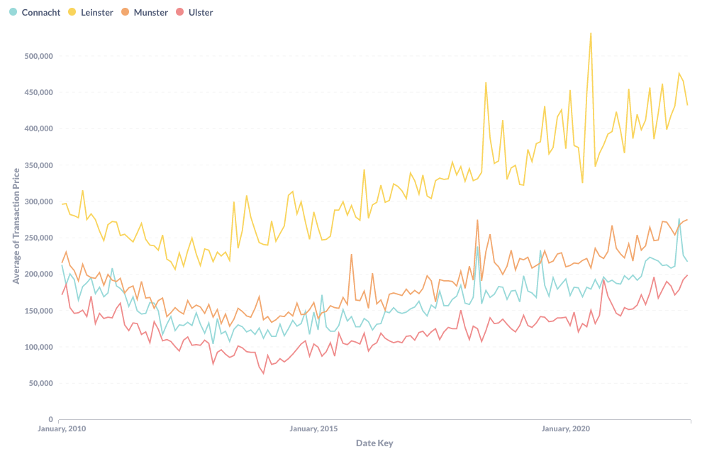
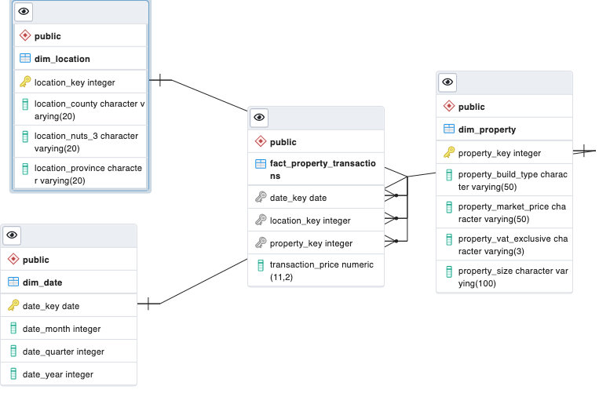

<!-- PROJECT LOGO -->
 

  

<h3 align="center">PPR House</h3>

  

   The Irish Property Price Register in a data warehouse.
  

## **About PPR House**

PPR House is the Irish property price register scraped from its source and loaded into a data warehouse. The files are queried using Python’s request library then stored in Amazon S3. From here, they are retrieved and then lightly transformed then loaded into a PostgreSQL database. Here, they are initially loaded into a staging table before transformation scripts are run to load them into a warehouse schema of 3 dimension tables and 1 fact table. Compared to 3NF databases designed for CRUD transactions, a data warehouse is structured specifically for performing data analysis queries like joins and aggregations.

The primary motivation behind this project is to allow people to more easily perform data analysis on the Property Price Register, as this is currently only available in the form of .xlsx files. A secondary motivation is generating public dashboards so that developments in the Property Price Register can be monitored. Being a direct source of truth about the Irish property market, it should be possible to track price movements in the property market on a weekly basis. This will be more an up-to-date source than reports such as the Daft House Price Report, which are typically published on a quarterly or annual basis.

Below is an impression of how rolling analysis of property prices via the PPR could look like, showing changes in property prices over time for each province (example generated in Metabase):

 

 
V1 of the project will consist of:

- A data warehouse.
- A Python package to query the latest entries on the Property Price Register on a weekly basis and inject the latest sales into the warehouse (running on the basis of an EtLT pipeline).
- A frontend that will present dashboards of the latest movements in the Irish property market.
- A server that will provide endpoints for users to run their own SQL queries on the warehouse.

### Built With

## Getting Started

You will need to clone the repo locally to launch the data warehouse.

### To stand-up the data warehouse using Docker.

The data warehouse can easily be stood up using the docker-compose.yml file. To do so, simply do the following:

- Download and [install Docker](https://docs.docker.com/engine/install/ubuntu/) (Linux) / [install Docker Desktop](https://docs.docker.com/get-docker/) (Cross-Platform)
- To stand up the database: run `docker-compose up`
- To also stand up a PGAdmin container: run `docker-compose --profile local up`

You can now use your PostgresSQL Dashboard to query the database.

### To stand-up the data warehouse using backup.sql

The sql directory contains a `backup.sql` file which can be mounted into your SQL platform (must be compatible with plsql to run properly).

### Creating the warehouse from scratch.

It's also possible to query the website of the Property Price Register and create the warehouse from scratch. To do this, perform the following steps:

- Create a virtual environment using either the `environment.yml `or `requirements.txt` files.
- Set up an account on Amazon Web Services and create an S3 Bucket. This is expected to be called "ppr-pipeline" but this can be renamed as desired by changing the `BUCKET_NAME` constant defined in `ppr_pipeline/scrapers/__init__.py`.
- [Generate credentials](https://docs.aws.amazon.com/general/latest/gr/aws-sec-cred-types.html) to connect to your AWS on your local machine.
- Save the credentials generated to a `~/.aws/credentials` file. This should contain `aws_access_key_id` and `aws_secret_access_key` fields.
- Navigate into your copy of the repo and run `mkdir tmp logs`. These directories are required to convert data and log errors but are listed under `.gitignore` to prevent unnecessary data from being uploaded.
- Stand up the database using the `backup-clean.sql` file. This can also be done using `docker-compose`.yml by changing the reference in `volumes` from `backup-sql` to `backup-clean.sql` This will generate empty data warehouse tables.
- Run `python -m ppr_pipeline scrape_all` to query the latest data from the Property Price Register and inject the latest data into your S3 bucket.
- Run `python -m ppr_pipeline inject_all` to query the S3 bucket and inject the data there into your SQL database.
- Finally, open a SQL dashboard and run all non-backup files in the sql folder as queries. This will provide the necessary functions required for transformation and transform the data in staging into the data warehouse tables.

## Background

### EtLT (Extract transform Load Transform) Pipeline

PPR House injects data into the warehouse based on an EtLT pipeline methodology. This is orchestrated as follows for the PPR House:

- Extract: Data is extracted at source and loaded into object storage.
- Little transform: Prior to loading, minor transformations are made. Here, the euro sign is removed from prices due to some encoding peculiarities and duplicate entries excluded.
- Load: The data is loaded in a more-or-less raw format into the staging table within the data warehouse.
- Big Transform: Data is transformed within the SQL database and loaded into fact and dimension tables.

The main advantage offered by the EtLT method over the traditional ELT method is the significant performance advantage associated with doing transformations directly in SQL. With approx. 450,000 transactions currently in the register, running transformation scripts in Python can take minutes. Doing the same transformation job in plsql can be run in a few seconds.

### Data Warehouse

Databases which enable services such as web applications are known as Online Transaction Processing (OLTP) databases. These are designed to be written to frequently, which requires highly normalised data. By contrast, the work of a data analyst requires a database optimised for a high quanity of reads as well as for queries like joins and aggregations. The data contained in an OLAP are de-normalised, meaining that there are far less tables but there is a high-degree of redundancy within each table.

Many styles of OLAP database have been created in order to manage these redundancies. One such style is known as a data warehouse, which is based around the idea of fact and dimension tables. A fact is the observation or event that the database is measuring, e.g. the price of a transaction. The dimension tables contain information to allow these facts to be further analysed, e.g. what are the prices in a particular county. Each entry in the fact table contains a reference to one row in each dimension table, providing the link between facts and their dimensions.

## Warehouse Schema

### staging

This is the table that receives data directly from the S3 bucket.

Schema: `address, price, date_of_sale, county, eircode, price, not_full_market_price, vat_exclusive, description_of_property, property_size_description`

### fact_property_transactions

Each entry within the Property Price Register is considered as a single fact, with each fact therefore representing a transaction. This means that no discrimination is made to the transaction being of the sale of one or multiple properties.

Schema: `date_key, location_key, property_key, transaction_price`

### dim_date

Dim_date presents the dimension of time in table. Each date featured on a transaction in the fact_table is represented, with additional levels of grain for time offered.

Schema: `date_key, date_month, date_quarter, date_year`

### dim_location

Dim_location presents the dimension of a property's location in the table. This is based around the county field within the PPR, with additional levels of grain added within the database transformation process.

Schema: `location_key, location_county, location_nuts_3, location_province`

### dim_property

Dim_property presents the dimension of elements of a particular transaction, such as if the building was a new build. This is based around a selection of the remaining fields within the staging table.

Schema: `property_key, property_build_type, property_market_price, property_vat_exclusive, property_size`

## Roadmap

- [ ] Query the data warehouse once per week and orchestrate EtLT pipeline using Apache Airflow.
- [ ] Create a frontend dashboard to show rolling coverage from the Property Price Register.
- [ ] Create a server to allow external users to run their own query on the data warehouse.
- [ ] Create docs and demonstration articles on the frontend on how to best query the warehouse.
- [ ] Provide more heavily transformed versions of the Property Price Register that addresses errors within the original data and introduces greater degrees of grain.

## Acknowledgements

- Icon credit: https://github.com/alexandresanlim/Badges4-README.md-Profile
- README template credit: https://github.com/othneildrew/Best-README-Template
